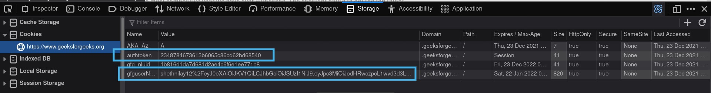

# GFG-CLI

CLI-application for solving DSA problems available on [GeeksForGeeks]("https://www.geeksforgeeks.org/") right from your terminal and also inside from your favourite text editor or ide


## Installation

```bash

git clone https://github.com/nilay1221/gfg-cli

cd gfg-cli

pip3 install requirements.txt

```


## Usage

- **Config file**\
A config.json needs to be created for testing and submmiting the problem.
```json
{
"authtoken":"<Your Auth token>",
"gfguserName":"<Your GFG username>"
}
```
Once you have created this you just need to set the path to config
```bash
python3 main.py config ./config.json #Path to config file
```
For more information, view [this](#get-config)
- **Fetching the problem**\
To get question code for eg if this is the question link "https://practice.geeksforgeeks.org/problems/quick-sort-on-linked-list/1/*" then **quick-sort-on-linked-list** is the question code
```bash
# For fetching the problem use get subcommand and input the question code
# and the language for which you want to solve the problem
python3 main.py get -C quick-sort-on-linked-list -l cpp

#Output will be file created having same name of questioncode
```
- **Testing the problem**\
For testing the problem
```bash
# For testing your code using sample input just run this command
# This will take filename as the question code if you have different file use -C argument
python3 main.py test quick-sort-on-linked-list.cpp
```
- **Submitting the problem**
```bash
python3 main.py submit quick-sort-on-linked-list.cpp #Filename
```

## <a name="get-config"></a>Getting config vars
1. Login into [GeeksForGeeks]("https://www.geeksforgeeks.org/")
2. Open Inspect Console go to Storage tab and copy the authoken and gfguserName values

